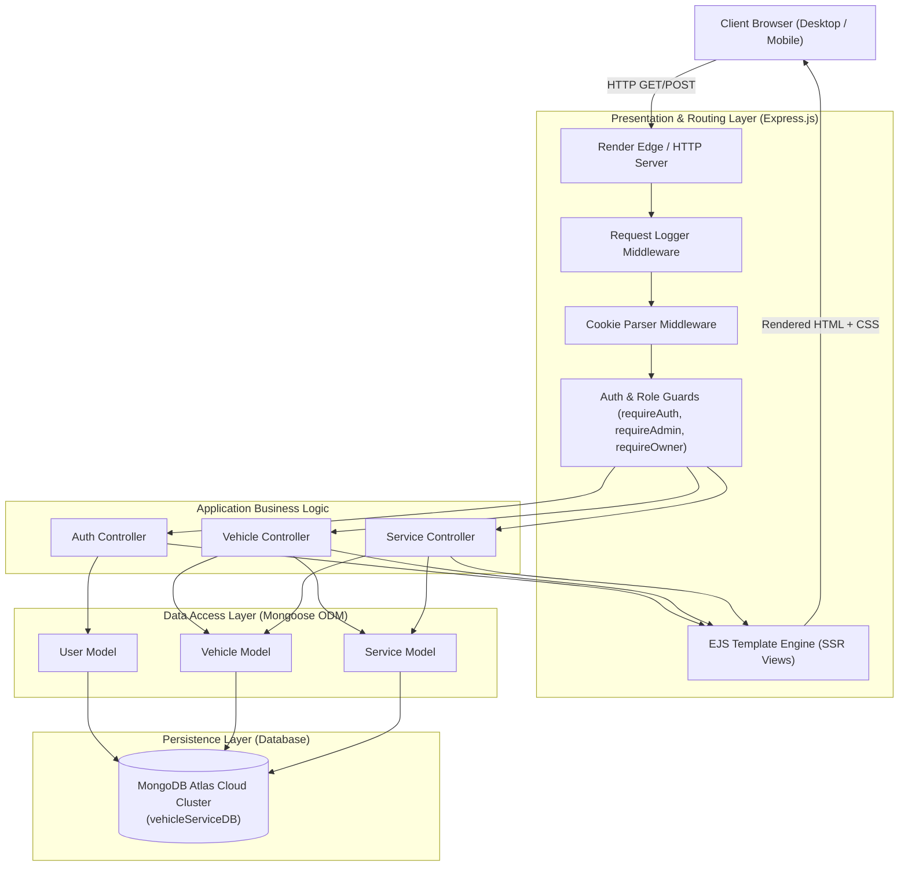
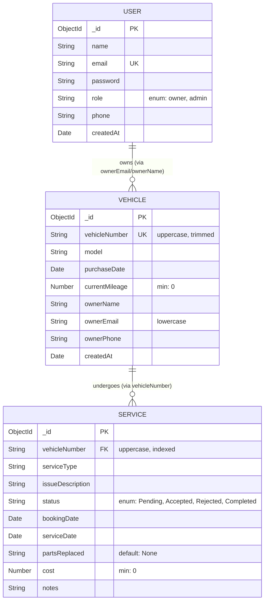
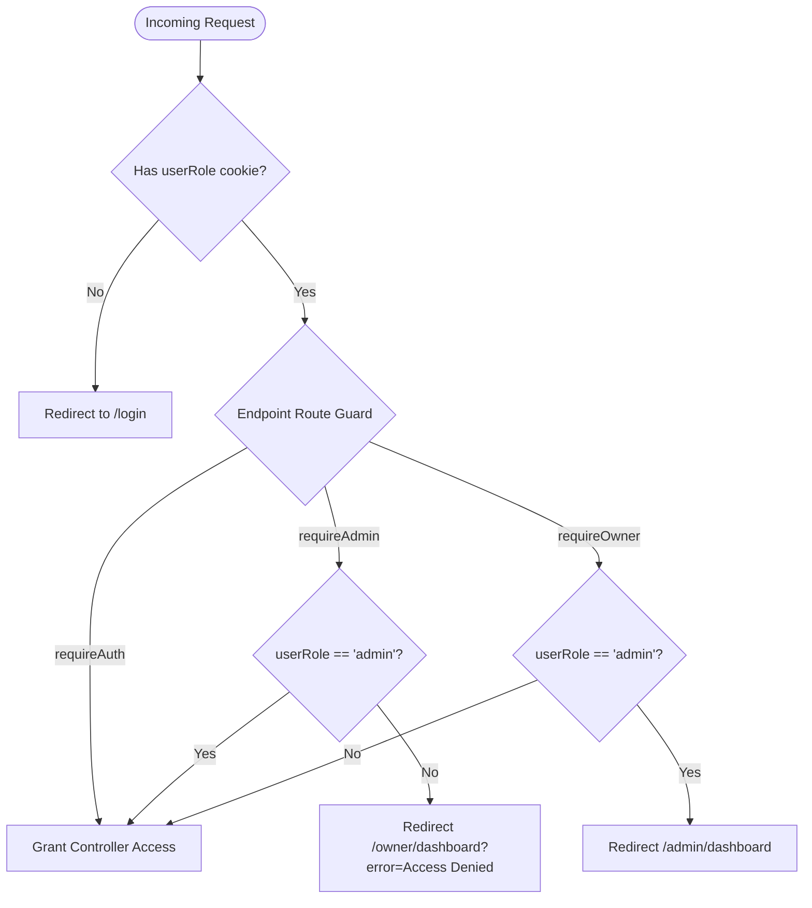
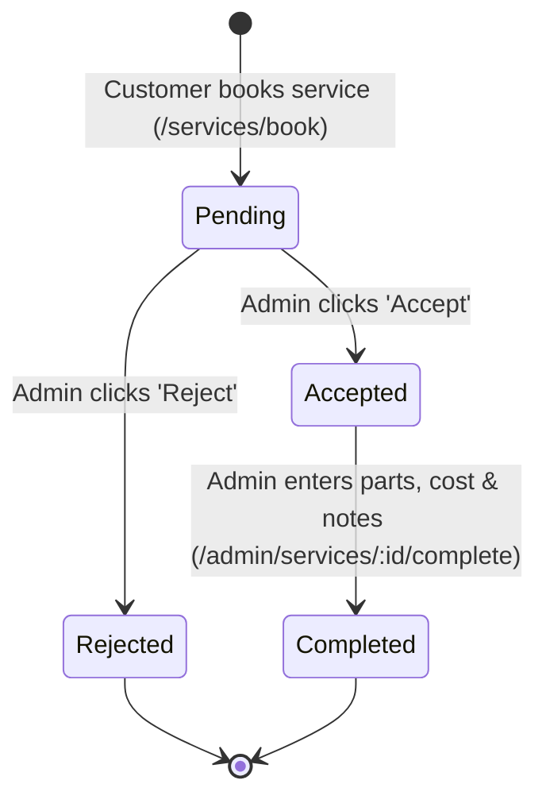
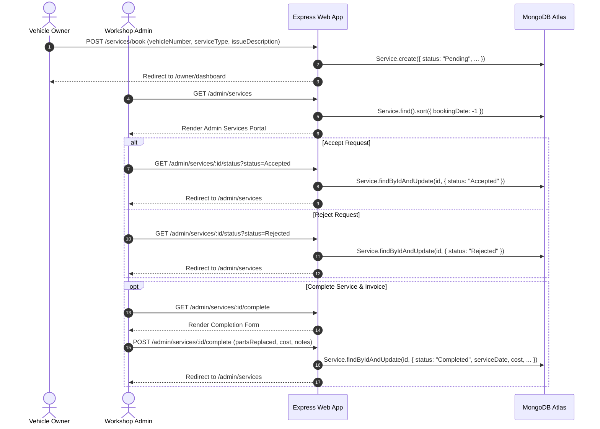
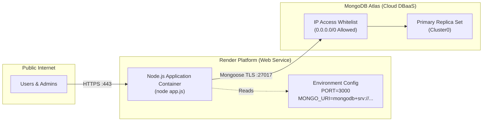

# System Design Document: Vehicle Service & Maintenance Management System

A production-ready architectural and technical design document for the **Vehicle Service & Maintenance Management System**, a Server-Side Rendered (SSR) full-stack web application designed for automotive workshops, service centers, and vehicle owners.

---

## 1. System Overview & Problem Statement

### 1.1 Purpose
The Vehicle Service & Maintenance Management System streamlines end-to-end garage operations, vehicle health tracking, service scheduling, and maintenance billing. It bridges communication between **Vehicle Owners** (customers) and **Workshop Administrators** (service engineers / center managers).

### 1.2 Core Capabilities
- **Role-Based Isolation**: Tailored interfaces and access controls for Vehicle Owners and Workshop Admins.
- **Fleet & Asset Registry**: Centralized catalog of registered vehicles with VIN/license plates, models, purchase dates, and current mileages.
- **Service Lifecycle Orchestration**: Multi-stage state machine (`Pending` $\rightarrow$ `Accepted`/`Rejected` $\rightarrow$ `Completed`) with parts recording and cost calculation.
- **Proactive Maintenance Alerts**: Automated recommendation engine alerting owners and admins when a vehicle exceeds 10,000 km or 6 months without service.
- **Financial & Historical Auditing**: Per-vehicle timeline tracking all historical services, replaced components, and cumulative maintenance expenditures.

---

## 2. High-Level System Architecture

The application adopts an **MVC (Model-View-Controller) Server-Side Rendered (SSR)** Monolithic Architecture powered by **Node.js**, **Express**, **EJS**, and **MongoDB Atlas**.



---

## 3. Data Models & Database Schema Design

The persistence tier utilizes MongoDB via the Mongoose ODM. Data is stored in three primary collections: `users`, `vehicles`, and `services`.

### 3.1 Entity Relationship Diagram (ERD)



### 3.2 Schema Specifications

| Collection | Field | Type | Constraints | Purpose |
| :--- | :--- | :--- | :--- | :--- |
| **User** | `_id` | `ObjectId` | Primary Key, Auto | Internal identifier |
| | `name` | `String` | Required, Trimmed | Full user display name |
| | `email` | `String` | Required, Unique, Lowercase | Primary account login identifier |
| | `password` | `String` | Required | Authentication credential |
| | `role` | `String` | Enum: `["owner", "admin"]`, Default: `"owner"` | Authorization access level |
| | `phone` | `String` | Optional, Default: `""` | Contact number for updates |
| | `createdAt` | `Date` | Default: `Date.now` | Account creation timestamp |
| **Vehicle** | `_id` | `ObjectId` | Primary Key, Auto | Internal vehicle record ID |
| | `vehicleNumber`| `String` | Required, Unique, Uppercase | License plate / registration tag |
| | `model` | `String` | Required, Trimmed | Make & model description (e.g. Honda City) |
| | `purchaseDate` | `Date` | Required | Vehicle acquisition date (used for service age) |
| | `currentMileage`| `Number` | Required, Min: `0` | Vehicle odometer reading in kilometers |
| | `ownerName` | `String` | Required, Trimmed | Registered owner display name |
| | `ownerEmail` | `String` | Lowercase, Indexed | Association with customer user account |
| | `ownerPhone` | `String` | Optional | Emergency owner phone contact |
| | `createdAt` | `Date` | Default: `Date.now` | Registration timestamp |
| **Service** | `_id` | `ObjectId` | Primary Key, Auto | Service order identifier |
| | `vehicleNumber`| `String` | Required, Uppercase | Foreign reference linking service to a vehicle |
| | `serviceType` | `String` | Required | E.g. Oil Change, Brake Inspection, Major Overhaul |
| | `issueDescription` | `String` | Default: General checkup | Customer problem report / notes |
| | `status` | `String` | Enum: `Pending`, `Accepted`, `Rejected`, `Completed` | Current state of the service ticket |
| | `bookingDate` | `Date` | Default: `Date.now` | When booking was requested |
| | `serviceDate` | `Date` | Optional | Date service was performed/completed |
| | `partsReplaced`| `String` | Default: `"None"` | Itemized parts used during repair |
| | `cost` | `Number` | Min: `0`, Default: `0` | Billed service charge |
| | `notes` | `String` | Optional | Technician findings and comments |

---

## 4. Authentication, Authorization & Session Management

The system implements a stateless cookie-driven session model, decoupling session verification from server memory for lightweight cloud deployments.

### 4.1 Cookie Structure & Injection
On successful login (`authController.login`), the server injects three cookies:
- `userRole`: `"admin"` or `"owner"`
- `userName`: The full name of the user
- `userEmail`: The registered email

Global Express middleware automatically extracts these cookies into `res.locals` so that all EJS views have direct access to user session details:
```javascript
res.locals.currentUser = req.cookies.userName || null;
res.locals.currentRole = req.cookies.userRole || null;
res.locals.currentEmail = req.cookies.userEmail || null;
```

### 4.2 Role-Based Access Control (RBAC) Matrix



| Route Pattern | Guard Middleware | Allowed Roles | Unauthenticated / Unauthorized Behavior |
| :--- | :--- | :--- | :--- |
| `/` | *None* (Public) | All (Public) | Redirects authenticated users to their specific dashboard |
| `/login`, `/register` | *None* (Public) | Guests | If already authenticated, redirects to respective dashboard |
| `/dashboard` | *None* (Smart Redirect)| Authenticated | Redirects to `/admin/dashboard` or `/owner/dashboard` |
| `/owner/dashboard` | `requireOwner` | Vehicle Owner | Redirects admin to `/admin/dashboard`, guests to `/login` |
| `/admin/dashboard` | `requireAdmin` | Admin only | Denies owner with error redirect, guests to `/login` |
| `/vehicles` | `requireAuth` | Owner / Admin | Renders personal fleet for owner, complete fleet for admin |
| `/vehicles/add` | `requireAuth` | Owner / Admin | Allows registering a vehicle |
| `/vehicles/:num/history` | `requireAuth` | Owner / Admin | Displays full timeline & total spend for the vehicle |
| `/vehicles/delete/:id` | `requireAdmin` | Admin only | Deletes a vehicle record from inventory |
| `/services/book` | `requireAuth` | Owner / Admin | Allows submitting a service ticket |
| `/admin/services*` | `requireAdmin` | Admin only | Ticket status changes, parts logging & invoicing |
| `/health` | *None* (Public) | All | Returns JSON status `{ status: "OK" }` |

---

## 5. Core Operational Workflows

### 5.1 Service Booking & Lifecycle State Machine

A service ticket moves through a sequential state machine managed by customer and admin actions:



#### Workflow Sequence:



### 5.2 Maintenance Reminder Algorithm

Both dashboards dynamically calculate service alerts without requiring heavy background cron jobs:
- **Condition 1 (Mileage threshold)**: `currentMileage >= 10,000 km`
- **Condition 2 (Time threshold)**: `purchaseDate <= 6 months ago`

```javascript
const sixMonthsAgo = new Date();
sixMonthsAgo.setMonth(sixMonthsAgo.getMonth() - 6);

const serviceReminders = vehicles.filter(v => 
    v.currentMileage >= 10000 || 
    (v.purchaseDate && new Date(v.purchaseDate) <= sixMonthsAgo)
);
```

### 5.3 Vehicle Expenditure & Analytics Calculation

On the Vehicle History page (`/vehicles/:vehicleNumber/history`), total expenditure is computed using functional array reduction over completed services:

$$\text{Total Expenditure} = \sum_{s \in \text{Services}, s.\text{status} = \text{"Completed"}} s.\text{cost}$$

Similarly, the Admin Dashboard computes aggregate workshop revenue across all completed jobs.

---

## 6. Deployment & Infrastructure Architecture



### 6.1 Cloud Components
- **Hosting Provider**: [Render.com](https://render.com)
  - Runtime: Node.js 18+ / Native environment
  - Build Command: `npm install`
  - Start Command: `node app.js`
  - Port Configuration: Automatically exposed via `PORT` environment variable
- **Database Provider**: [MongoDB Atlas](https://cloud.mongodb.com)
  - Topology: Multi-AZ Replica Set (`Cluster0`)
  - Connection protocol: `mongodb+srv://` with TLS encryption
  - Network Rules: Requires `0.0.0.0/0` whitelisted to permit inbound connections from dynamic Render server IP pools.

---

## 7. Security, Reliability & Future Recommendations

### 7.1 Implemented Robustness Measures
1. **Connection Resilience**: `serverSelectionTimeoutMS: 5000` prevents indefinite hanging if MongoDB Atlas is unreachable.
2. **Post-Connection Seeding**: Automatic admin seed (`seedDefaultUsers`) is gated behind `await mongoose.connect(...)` to avoid query buffering timeouts.
3. **Strict Credential Sanitization**: Case-insensitive email normalization (`toLowerCase().trim()`) prevents duplicate and mismatched account lookups.

### 7.2 Recommended Production Enhancements

- **Password Hashing**: Currently passwords are stored in plain text. Integrate `bcryptjs` with salt rounds $\ge 10$ prior to saving users.
- **Stateless Session Tokens (JWT)**: Replace plain cookie attributes (`userRole`, `userName`) with cryptographically signed, `httpOnly`, `secure`, and `sameSite: strict` JSON Web Tokens to prevent client-side cookie tampering.
- **Input Validation**: Introduce validation libraries like `express-validator` or `zod` for strict request payload validation.
- **Database Indexing**: Add compound indexes on `{ vehicleNumber: 1, bookingDate: -1 }` and `{ ownerEmail: 1 }` to accelerate query execution as records scale.
